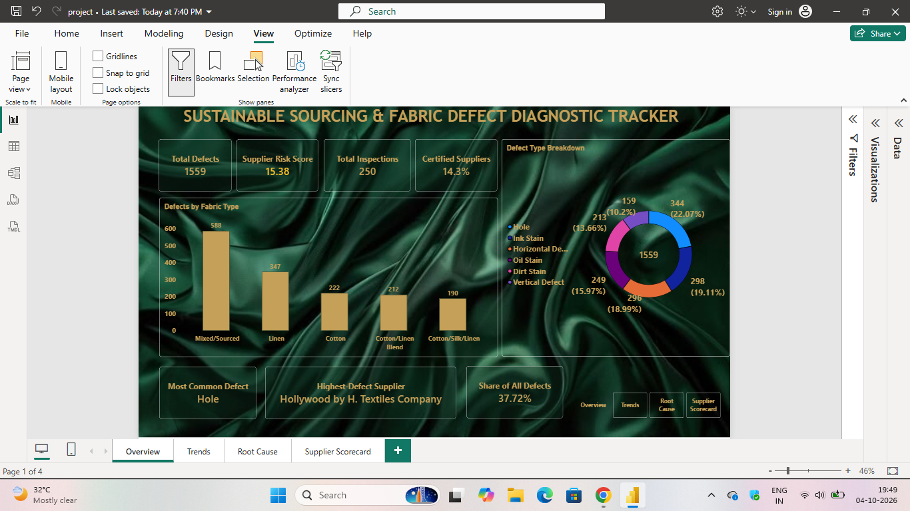
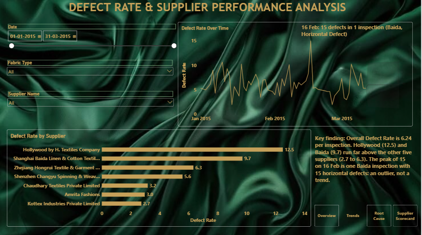
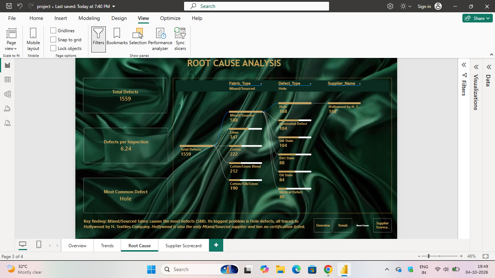
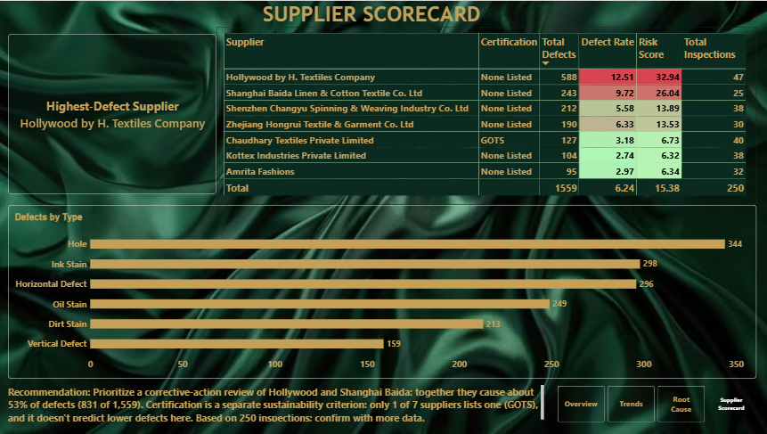

# Sustainable Sourcing & Fabric Defect Diagnostic Tracker

An interactive Power BI dashboard that diagnoses fabric defects, compares supplier performance and highlights sourcing risk, based on **250 inspections** and **1,559 recorded defects** across 7 suppliers.

## Business Problem

Textile buyers need to know which suppliers and fabric types cause the most quality problems, whether the problems are ongoing or one-off, and whether sustainability certification relates to better quality. This dashboard answers those questions and recommends where to act first.

## Dashboard Preview

### 1. Overview

### 2. Trends

### 3. Root Cause

### 4. Supplier Scorecard

## Dashboard Pages

| Page | What it shows |
|------|---------------|
| **Overview** | KPI cards (total defects, risk score, total inspections, certified suppliers), defects by fabric type, defect type breakdown, most common defect, highest-defect supplier |
| **Trends** | Defect rate over time (Jan to Mar 2015) and defect rate by supplier, with slicers for date, fabric type and supplier |
| **Root Cause** | Decomposition tree from total defects to fabric type to defect type, plus a fabric and supplier table with defect rates |
| **Supplier Scorecard** | Supplier table with certification, total defects, defect rate, risk score and inspections, with colour-coded risk, defects by type, and a recommendation |

## Key Metrics

| Metric | Value |
|--------|-------|
| Total defects | 1,559 |
| Total inspections | 250 |
| Overall defect rate | 6.24 defects per inspection |
| Overall risk score | 15.38 |
| Suppliers with certification | 14.3% (1 of 7) |
| Most common defect | Hole (344 defects, 22.07%) |
| Highest-defect supplier | Hollywood by H. Textiles Company |
| Top supplier's share of all defects | 37.72% |

## Key Findings

1. **Two suppliers drive most of the problem.** Hollywood by H. Textiles (defect rate 12.51) and Shanghai Baida Linen & Cotton Textile (9.72) are far above the other five suppliers (2.7 to 6.3). Together they cause about **53% of all defects** (831 of 1,559).
2. **Mixed/Sourced fabric has the most defects (588).** Its most common defect is Hole (168). All of it comes from Hollywood, its only supplier, so fabric effects and supplier effects cannot be separated.
3. **Supplier practices matter within the same fabric.** Within Linen, Baida (9.7) and Kottex (2.7) differ by about **3.5x**, which points to supplier practices rather than the fabric itself.
4. **The February spike is an outlier, not a trend.** The peak of 15 defects on 16 Feb comes from a single Baida inspection with 15 horizontal defects.
5. **Certification does not predict fewer defects here.** Only one supplier (Chaudhary Textiles, GOTS) lists a certification. It has a low defect rate (3.18), but certification is a separate sustainability criterion and one supplier is too few to draw conclusions.

### Defects by Type

| Defect type | Count | Share |
|-------------|-------|-------|
| Hole | 344 | 22.07% |
| Ink Stain | 298 | 19.11% |
| Horizontal Defect | 296 | 18.99% |
| Oil Stain | 249 | 15.97% |
| Dirt Stain | 213 | 13.66% |
| Vertical Defect | 159 | 10.20% |

### Supplier Scorecard Summary

| Supplier | Certification | Defects | Defect Rate | Risk Score | Inspections |
|----------|---------------|---------|-------------|------------|-------------|
| Hollywood by H. Textiles Company | None listed | 588 | 12.51 | 32.94 | 47 |
| Shanghai Baida Linen & Cotton Textile Co. Ltd | None listed | 243 | 9.72 | 26.04 | 25 |
| Shenzhen Changyu Spinning & Weaving Industry Co. Ltd | None listed | 212 | 5.58 | 13.89 | 38 |
| Zhejiang Hongrui Textile & Garment Co. Ltd | None listed | 190 | 6.33 | 13.53 | 30 |
| Chaudhary Textiles Private Limited | GOTS | 127 | 3.18 | 6.73 | 40 |
| Kottex Industries Private Limited | None listed | 104 | 2.74 | 6.32 | 38 |
| Amrita Fashions | None listed | 95 | 2.97 | 6.34 | 32 |

## Recommendation

Prioritize a corrective-action review of **Hollywood** and **Shanghai Baida**, since together they account for about 53% of all defects. Because the data covers only 250 inspections over about 10 weeks, these findings should be confirmed with more data.

## Tools & Skills Used

- **Power BI Desktop** for report design and interactivity
- **DAX** for measures such as Defect Rate, Risk Score and Share of All Defects
- **Data modelling** with a Calendar table for time analysis
- **Visuals:** KPI cards, donut chart, column and bar charts, line chart, decomposition tree, conditional-format tables, slicers and page navigation buttons

## Repository Contents

| File | Description |
|------|-------------|
| `Fabric-Defect-Dashboard project.pbix` | Power BI project file (open with Power BI Desktop) |
| `dashboard.pdf` | PDF export of the dashboard |
| `01_overview.png` to `04_supplier_scorecard.png` | Screenshots of each dashboard page |

## How to Use

1. Download the `.pbix` file from this repository.
2. Open it in [Power BI Desktop](https://powerbi.microsoft.com/desktop/) (free).
3. Use the slicers on the Trends page and the navigation buttons to explore the pages.

## Data Note

The dashboard covers inspections from **1 Jan 2015 to 31 Mar 2015**. Supplier and fabric names are as recorded in the source dataset.

## Author

Sandhiya.M/Linkedin ID:https://www.linkedin.com/in/sandhiya-m-b61504368?utm_source=share_via&utm_content=profile&utm_medium=member_android/msandhiya124@gmail.com
